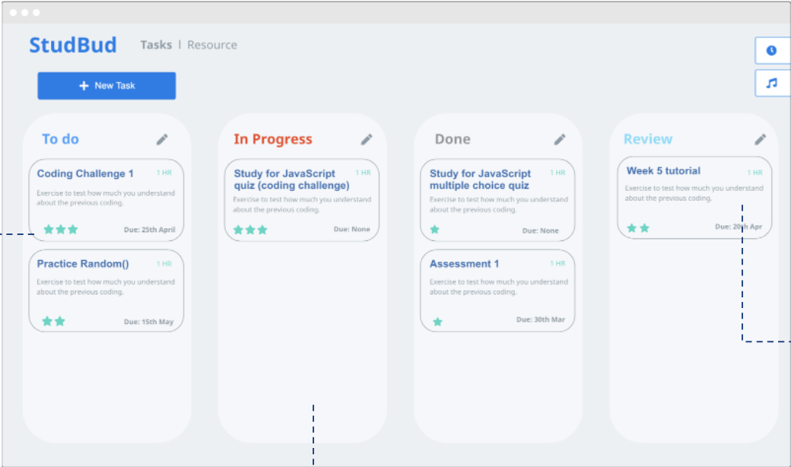
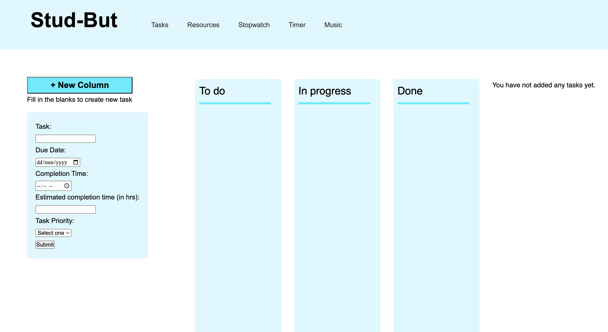
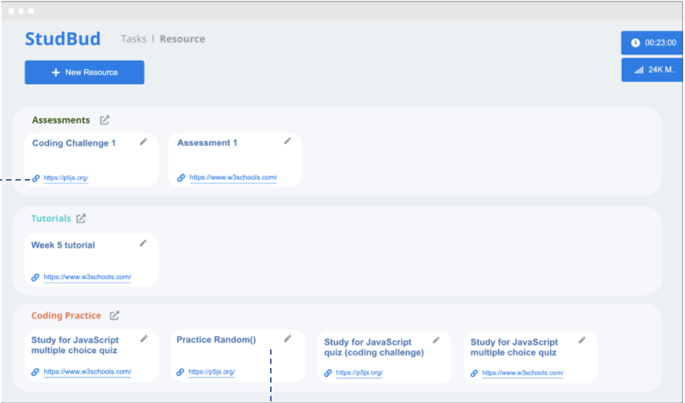
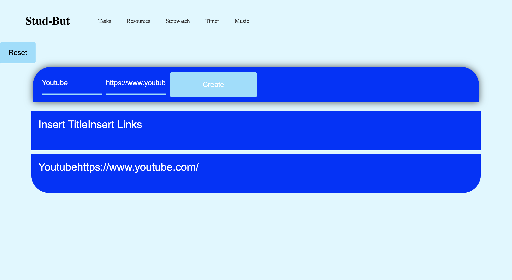
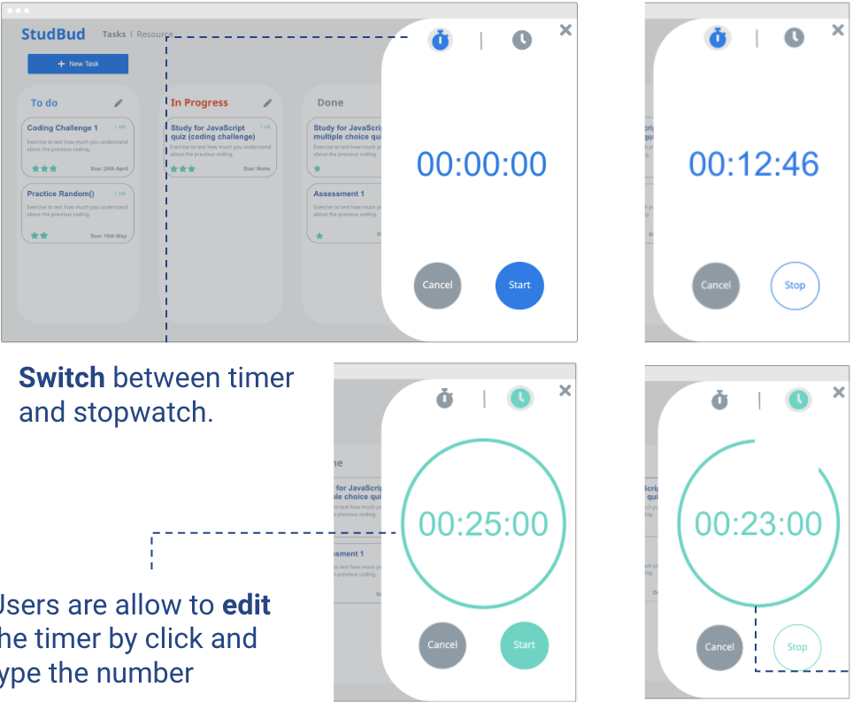
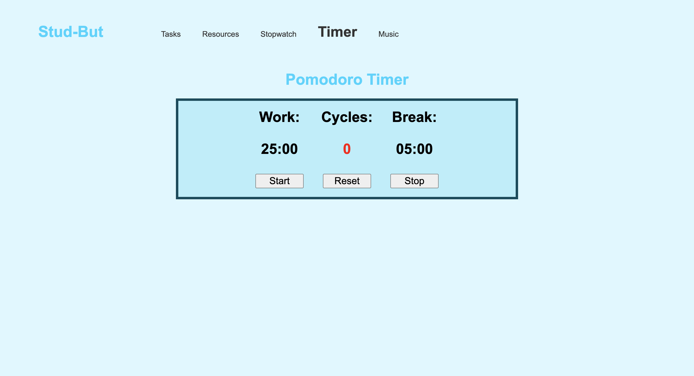
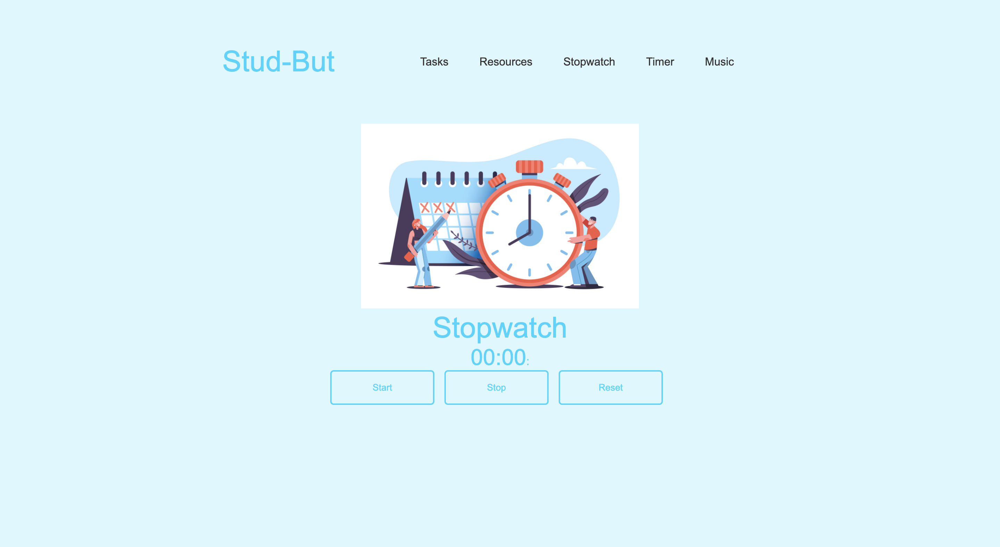
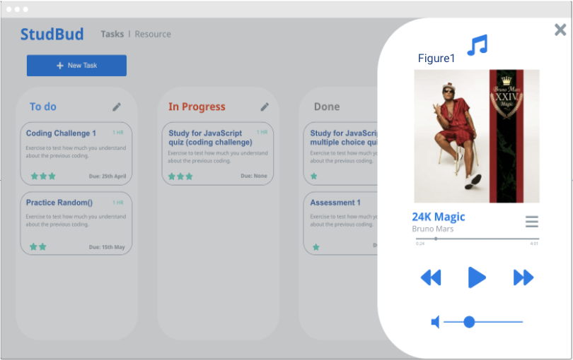
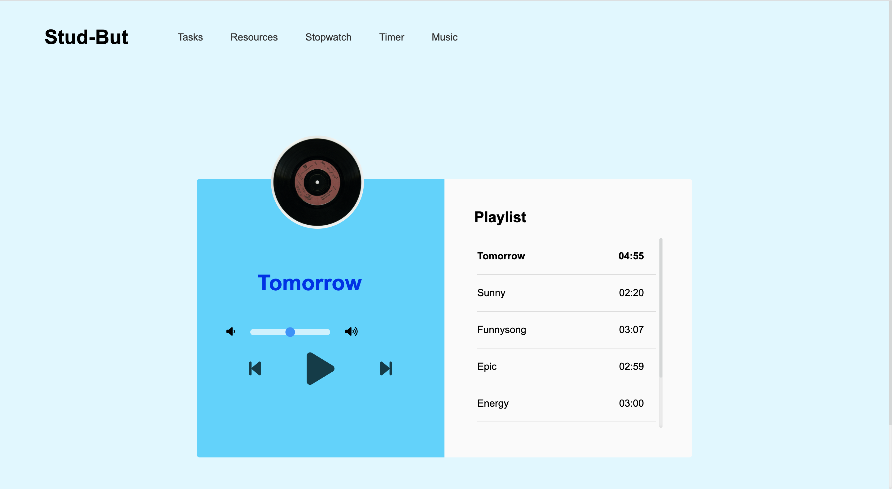

# Stud-bud

# Kanban Board
>For the task list, I have made big change on the task list. Instead of opening new page to create new task I have designed the task list as adding the new tasks from the left and show the kanban board from the left side of the screen. Therefore, it will help users easier to understand and provide less step for them to make.

>I have moved the icons into each list at the top so that it is easy for users to understand what functions are provided in the application. The most challenge part was to drag and drop the task list that has been made. I have edit the javScript by adding draggable but I did not know how to move through the column.

# Resource Page

>On the resource page I have made the design as simple as possible to allow the user easily master the functionality. 

Users are able to insert title and link to save the link for the easy access. Reset button are there to allow the users to reset their lists at anytime.

The most challenging part about the Resource was to create the structure showed in prototype. I realised it will be a lot simple and easy to use if I make the page with just title and link. Therefore, the change of design will help users to easily manage their resources.

# Stopwwatch and Timer Page

>In this page I have made stopwatch and timer in a different page so that is easier for users to access each pages.

I have designed timer with simple structure and used same theme color as all the other pages.

For the stopwatch page I have also kept as simple as possible to avoid any errors.

The most challenge part about these two pages were to amke them as pop up. I have tried to do the pop up however it did not work, therefore, I have made each page as individual page.

# Music Page

>The music page was created with title page and playlist page. By aligning two page next to each other users are able to easily keep on truck with the current music playing and up coming next. I have also added rotating image to make the page intresting.

The most challenge part for the music page was to make the image rotate when the music start and stop it when the music stop. I found it very hard to find out that the animation can be added through css instead of going through big codings in javascript.

# Reference

dcode. (2021). How to Build a Kanban Board with JavaScript (No Frameworks). YouTube. Retrieved June 2, 2022, from https://www.youtube.com/watch?v=ijQ6dCughW8&amp;t=241s. 

Gowtham Tirri. (2020). Build A StopWatch Using Vanilla JavaScript Tutorial. Retrieved June 2, 2022, from https://www.youtube.com/watch?v=oMwaMYwHkS8. 

learn-webdev. (2020). Pomodoro Timer | Javascript Beginner Project Tutorial. Retrieved June 2, 2022, from https://www.youtube.com/watch?v=vAEG6OVCass&amp;t=256s. 

Sameer Saini. (2021). How To Create a JavaScript Music Player From Scratch - Fun JavaScript Project For Beginners. Retrieved June 2, 2022, from https://www.youtube.com/watch?v=xPbvYWA7wVk&amp;t=2679s. 

Web work. (2021). List Creator with JavaScript | JavaScript Tutorial | Web Work. Retrieved June 2, 2022, from https://www.youtube.com/watch?v=SYeCxhlw9-E. 

All the resources are from https://www.w3schools.com/

All the icons are from fontawesome.com 